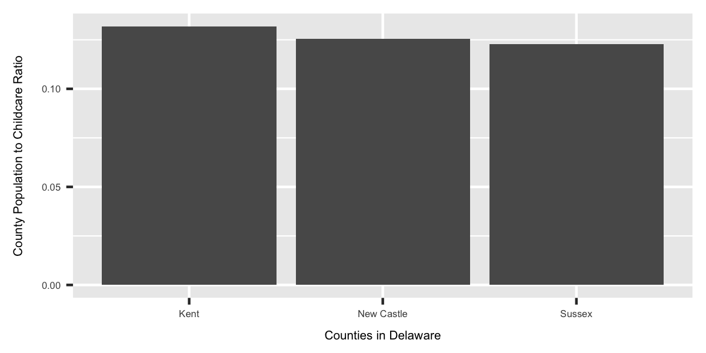

# Childcare dataset analysis

## Sources
The sources for this analysis have been downloaded from the below links
* https://data.delaware.gov/Human-Services/Licensed-Child-Care-Providers-and-Facilities/iuzd-3dbt
* https://data.delaware.gov/Education/School-Directory/wky5-77bt

## Munging
### Join Childcare dataset with schools dataset
Join the Childcare data with schools dataset to identify schools that have childcare.

## Analysis
Perform exploratory data analysis to extract valuable insights from the data. Especially some of the below questions
* how much hours of salary needed to pay daycare
* are the centers flexible?
* cost of childcare? Can people move to a different childcare which cost less
* How many schools provide childcare - why and why not?

## Plots
Plot the below dimensions to visualize the data
* Ratio of childcare centers to population per county

